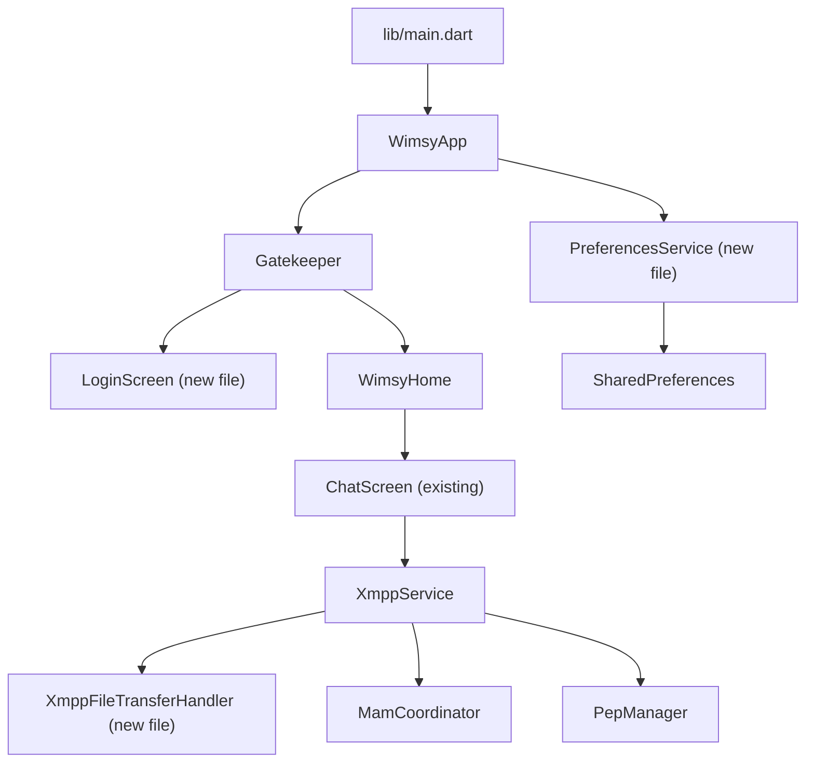

# Overview

## Codebase Review & Cleanup Plan

### Project State
Wimsy is a cross-platform XMPP client built in Flutter/Dart. The codebase is generally well-structured, with clear separation of concerns in most areas. Tests pass cleanly on the `quic` branch (`145` Flutter tests, `64` xmpp_stone tests, `flutter analyze` clean).

The QUIC work is functionally complete but the two largest files — `lib/main.dart` (6514 lines) and `lib/xmpp/xmpp_service.dart` (7952 lines) — have grown into monoliths that make navigation, testing, and future changes increasingly difficult.

### Key Problems Found

 Area | Problem | Risk |
---|---|---|
 `main.dart` size | 6514 lines; UI + business logic + account management + notification handling all in one file | Hard to navigate; discourages adding tests |
 `xmpp_service.dart` size | 7952 lines; everything from connection setup to MAM to file transfer to AV calls | High coupling; untestable internals |
 `SharedPreferences` access | Called 14 times throughout `main.dart` in ad-hoc one-shot calls, often in widget callbacks | Scattered preference keys; easy to mistype; no central source of truth |
 `ChatMessage` copy pattern | Every mutation (merge, correction, reaction) manually recopies all 28+ fields in a long `ChatMessage(...)` constructor call — repeated in `mam_merge_engine.dart`, `chat_message_mutations.dart`, and `xmpp_service.dart` | Error-prone; fields added to `ChatMessage` must also be added to every copy site |
 Notification ID collisions | `id: DateTime.now().millisecondsSinceEpoch.remainder(1 << 31)` — same JID can get two notifications with different IDs in rapid succession, preventing grouped dismiss | Minor but real bug |
 `Log.logLevel = LogLevel.VERBOSE` in production `main()` | Verbose XMPP XML logging left on by default for all users | Wasted I/O; leaks stanza content to device logs |
 Missing `copyWith` on `ChatMessage` | The model has no `copyWith` method despite being copied in many places | Maintenance burden; risk of field omission bugs |
 `_WimsyHomeState` build methods | `_buildLogin` and `_buildClient` are inline in the 6514-line file rather than extracted to separate screen widgets | Harder to test and read |
 `doap.xml` XEP list | Needs verification that newly implemented XEPs (QUIC/XEP-0467, updated SASL2 pipelining) are reflected | Compliance documentation out of date |


# Technical Design

## Technical Design

### 1. Add `copyWith` to `ChatMessage`

**File:** `lib/models/chat_message.dart`

Add a `copyWith({...})` method with all optional parameters defaulting to the current value. This eliminates the current pattern of manually listing all 28+ fields in mutation sites.

```dart
ChatMessage copyWith({
  String? from,
  String? to,
  String? body,
  ...
  Object? mamId = _sentinel,  // use sentinel to distinguish null-clear from absent
}) { ... }
```

Callers in `mam_merge_engine.dart`, `chat_message_mutations.dart`, and `xmpp_service.dart` are updated to use `copyWith`.

### 2. Centralise `SharedPreferences` keys and access

**New file:** `lib/storage/preferences_service.dart`

Create a `PreferencesService` class that holds all preference key constants and provides typed getters/setters. Existing callers (`main.dart`, `_WimsyHomeState`, `_PinSetupScreen`, etc.) are updated to use it.

```dart
class PreferencesService {
  static const _sentryOptInKey = 'sentry_opt_in';
  static const _pinIgnoredKey = 'wimsy_pin_ignored';
  static const _lastJidKey = 'wimsy_last_jid';
  // ... all other keys

  final SharedPreferences _prefs;
  PreferencesService(this._prefs);

  bool get sentryOptIn => _prefs.getBool(_sentryOptInKey) ?? false;
  Future<void> setSentryOptIn(bool value) => _prefs.setBool(_sentryOptInKey, value);
  // ...
}
```

This removes the 14 scattered `SharedPreferences.getInstance()` calls across `main.dart`.

### 3. Fix notification ID stability

**File:** `lib/main.dart`, `_WimsyHomeState._handleIncomingMessage`

Derive the notification ID deterministically from the sender JID (e.g. `bareJid.hashCode.abs() % (1 << 31)`) so that rapid messages from the same contact update the same notification rather than creating new ones.

### 4. Disable verbose XMPP logging in production builds

**File:** `lib/main.dart`, `main()`

Change:
```dart
Log.logLevel = LogLevel.VERBOSE;
Log.logXmpp = true;
```
To only enable verbose logging in debug/profile mode:
```dart
assert(() {
  Log.logLevel = LogLevel.VERBOSE;
  Log.logXmpp = true;
  return true;
}());
```

### 5. Extract `LoginScreen` widget from `_WimsyHomeState._buildLogin`

**New file:** `lib/login_screen.dart`

Extract the ~1100-line `_buildLogin` method (login form, endpoint discovery, account fields, advanced options) into a standalone `LoginScreen` stateful widget with its own state class. Pass `XmppService` and `StorageService` down.

### 6. Extract `XmppFileTransferHandler` from `XmppService`

**New file:** `lib/xmpp/xmpp_file_transfer.dart`

All methods and state related to IBB and Jingle file transfer (the `_FileTransferSession` class, `_fileTransferSessions`, send/receive/cancel methods) can be extracted to a dedicated handler class, reducing `xmpp_service.dart` by ~600 lines.

### 7. Update `doap.xml`

Verify and update XEP entries:
- XEP-0467 (QUIC transport) — new on this branch
- XEP-0388 SASL2 with IAP pipelining — extended
- Any other XEPs touched by recent commits

### Architecture Diagram




# Prioritised Changes

## Prioritised Changes

Changes are ordered by effort and risk:

### High priority (safety & correctness)

1. **Disable verbose logging in release builds** (`main()`) — trivial one-liner; prevents leaking XMPP stanza contents to device logs in production.
2. **Fix notification ID stability** — use a deterministic hash of bareJid instead of `DateTime.now()` to prevent notification stacking for the same sender.
3. **Add `copyWith` to `ChatMessage`** and replace manual copy blocks — reduces the risk of field omission bugs as `ChatMessage` grows.

### Medium priority (maintainability)

4. **Centralise `SharedPreferences` into `PreferencesService`** — removes 14 scattered `getInstance()` calls and consolidates all key strings.
5. **Extract `LoginScreen`** from `_WimsyHomeState` — significant reduction in `main.dart` size; no behavioural change.
6. **Extract `XmppFileTransferHandler`** from `XmppService` — reduces the 7952-line service; encapsulates IBB/Jingle transfer session state.

### Lower priority (polish)

7. **Update `doap.xml`** with new XEP-0467 and any updated SASL2 entries.
8. **Enable additional lint rules** in `analysis_options.yaml`.

### Out of scope for this cleanup
- Splitting `xmpp_service.dart` further beyond the file-transfer extraction (MAM handler, call session handler) — useful long-term but large scope.
- Extracting `ChatScreen` — even larger refactor, separate effort.
- State management migration (the `ChangeNotifier`/`AnimatedBuilder` pattern is working fine).
- New features or protocol work (see `doc/todo.md` and `doc/roadmap.md`).


# Testing

## Testing

### Validation Approach
- All existing tests (`flutter test`, `dart test` in `vendor/xmpp_stone`) must continue to pass after each stage.
- `flutter analyze` must remain clean.
- The `copyWith` implementation and mutation-site updates should be covered by the existing tests in `test/chat_message_mutations_test.dart`, `test/mam_merge_engine_test.dart`, etc.

### New Tests to Add
- `test/preferences_service_test.dart` — unit tests for `PreferencesService` getters/setters using a mock `SharedPreferences`.
- A test for the deterministic notification ID function (pure function, easy to unit test).

### Regression Checks
- After extracting `LoginScreen`: `test/widget_test.dart` smoke test should still pass (it exercises the login path).
- After `copyWith`: run `test/chat_message_test.dart` and `test/chat_message_mutations_test.dart` to confirm no regressions.


# Delivery Steps

###   Step 1: Fix verbose logging and notification ID stability in lib/main.dart
Two quick correctness issues in `lib/main.dart` are resolved and committed.

- In `main()`: guard `Log.logLevel = LogLevel.VERBOSE` and `Log.logXmpp = true` behind `assert(...)` so verbose XMPP logging is only active in debug/profile builds, never in release.
- In `_handleIncomingMessage` and `_handleIncomingRoomMessage`: replace `DateTime.now().millisecondsSinceEpoch.remainder(1 << 31)` with a deterministic ID derived from `bareJid.hashCode.abs() % (1 << 31)` to prevent notification stacking for the same sender.
- Run `flutter analyze` and `flutter test` to confirm no regressions; commit with detailed message.

###   Step 2: Add `copyWith` to `ChatMessage` and replace all manual copy sites
`ChatMessage` gains a `copyWith` method and every manual full-constructor copy block in the codebase is replaced with it.

- Add `ChatMessage copyWith({...})` to `lib/models/chat_message.dart` covering all 28+ fields; use a sentinel-object pattern for nullable fields so callers can explicitly clear them.
- Replace manual copy blocks in `lib/xmpp/mam_merge_engine.dart` (two sites).
- Replace manual copy blocks in `lib/xmpp/chat_message_mutations.dart` (two sites).
- Replace any manual copy blocks found in `lib/xmpp/xmpp_service.dart`.
- Run `flutter analyze`, `flutter test` (especially `chat_message_mutations_test.dart`, `mam_merge_engine_test.dart`); commit.

###   Step 3: Introduce `PreferencesService` and centralise all SharedPreferences access
`PreferencesService` in `lib/storage/preferences_service.dart` consolidates the 14 scattered `SharedPreferences.getInstance()` call sites currently spread across `lib/main.dart`.

- Create `lib/storage/preferences_service.dart` with all key constants and typed getters/setters (`sentryOptIn`, `pinIgnored`, `lastJid`, `audioInputId`, `videoInputId`, etc.).
- Initialise `PreferencesService` once at app startup in `main()` and pass it down to the widgets that need it.
- Replace all 14 inline call sites in `lib/main.dart` with `PreferencesService` API calls.
- Add `test/preferences_service_test.dart` with basic get/set unit tests using a fake/mock `SharedPreferences`.
- Run `flutter analyze` and `flutter test`; commit.

###   Step 4: Extract `LoginScreen` from `_WimsyHomeState` into `lib/login_screen.dart`
The login and account-setup portion of `_WimsyHomeState` (~1100 lines) is moved to a standalone widget, substantially reducing `lib/main.dart`.

- Create `lib/login_screen.dart` with a `LoginScreen` stateful widget containing the account form, endpoint discovery logic, advanced options panel, and connect button.
- Move relevant `TextEditingController` fields, `_handleConnect`, `_scheduleEndpointDiscovery`, `_discoverEndpoint`, and `_buildLogin` body into `LoginScreen`'s state class.
- Update `_WimsyHomeState.build` / `_Gatekeeper` to instantiate `LoginScreen` instead of calling `_buildLogin`.
- Verify `test/widget_test.dart` smoke test still passes; run `flutter analyze`; commit.

###   Step 5: Extract `XmppFileTransferHandler` from `XmppService` and update `doap.xml`
IBB/Jingle file-transfer session management (~600 lines) is extracted from `lib/xmpp/xmpp_service.dart` into its own class, and `doap.xml` is updated for newly implemented XEPs.

- Create `lib/xmpp/xmpp_file_transfer.dart` containing `XmppFileTransferHandler`, the `_FileTransferSession` model class, and all send, receive, accept, decline, and cancel methods for IBB and Jingle file transfer.
- Wire `XmppFileTransferHandler` into `XmppService` as a collaborating object, keeping all existing public method signatures on `XmppService` intact (thin delegation wrappers where needed).
- Update `doap.xml`: add XEP-0467 (QUIC transport for XMPP); review and update the XEP-0388 SASL2 / IAP pipelining entry.
- Run `flutter analyze` and `flutter test`; commit.