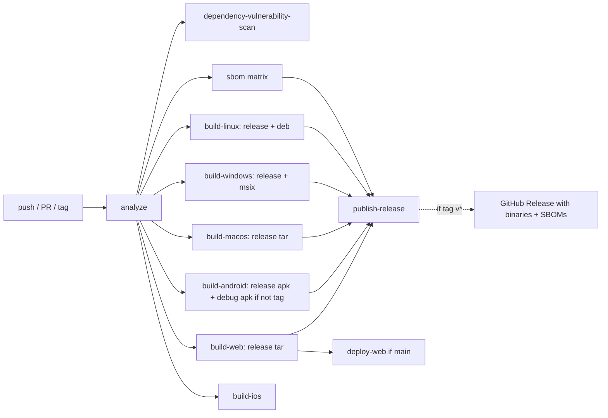

# Requirements

### Overview & Goals
Currently `.github/workflows/ci.yml` (runs on every push/PR) and `.github/workflows/release.yml` (runs only on `v*` tags) are two separate, largely duplicated pipelines. `ci.yml` builds debug/unpackaged artifacts for testing, while `release.yml` re-implements the same builds but produces installable packages (`.deb`, `.msix`, `.tar.gz`, `.zip`, release APK) and publishes them to a GitHub Release. The goal is to unify these into a single workflow so that **every commit** produces the same installable packages that a release would produce, and the **only** extra step for an actual `v*` tag push is uploading those already-built packages to a GitHub Release.

### Scope
**In Scope:**
- Merge `.github/workflows/release.yml` into `.github/workflows/ci.yml`; delete `release.yml`.
- Move all packaging logic (`.deb`, `.msix`, `.zip`, `.tar.gz`, release APK) from `release.yml` into the corresponding `build-*` jobs of `ci.yml`, so packages are produced on every push/PR.
- Add a `publish-release` job to `ci.yml`, gated to run only when the ref is a `v*` tag, that downloads the built packages and SBOMs and publishes them to the GitHub Release (reusing the existing `softprops/action-gh-release@v2` step).
- Keep the existing `analyze`, `dependency-vulnerability-scan`, `sbom`, `build-ios`, and `deploy-web` jobs running on every push/PR/tag exactly as today.
- Include the generated CycloneDX SBOM files as additional assets on the published GitHub Release (tag builds only).
- Android: always build the `--release` variant (so a real installable package exists on every commit); additionally build the `--debug` variant only on non-tag pushes/PRs (skip it on tag builds since it isn't needed for the release).

**Out of Scope:**
- Adding real code-signing for Android/Windows (both currently use debug/unsigned signing — no change).
- Publishing iOS or web artifacts to the GitHub Release (release.yml never did this; behavior unchanged).
- Changing the `deploy-web` GitHub Pages deployment logic.

### User Stories
- As a maintainer, I want every commit on `main` (and every PR) to produce the same installable packages (`.deb`, `.msix`, `.zip`, `.tar.gz`, release APK) that a tagged release would produce, so I can sanity-check installable builds before tagging a release.
- As a maintainer, I want tagging a commit with `v*` to simply take the already-built packages from that commit's CI run and publish them to a GitHub Release, instead of re-running a whole separate pipeline.
- As a maintainer, I want the SBOM reports to be attached to the published GitHub Release so consumers can audit dependencies for a given release.

### Functional Requirements
- On every push and pull request, `build-linux`, `build-windows`, `build-macos`, `build-android`, and `build-web` jobs must produce packaged, installable artifacts (not just raw build output directories) using the packaging steps currently only present in `release.yml`.
- The version-stamping logic (`Set Build Version` step, unchanged) continues to produce a `-pre-<sha>` version for non-tag builds and the tag version for `v*` tag builds.
- A new `publish-release` job runs **only** when `github.ref` matches `refs/tags/v*`, depends on all build jobs (and `sbom`), downloads their artifacts, and publishes them via `softprops/action-gh-release@v2`, matching today's `release.yml` asset list plus the SBOM files.
- All other jobs (`analyze`, `dependency-vulnerability-scan`, `sbom`, `build-ios`) keep running unconditionally on every push/PR/tag, as they do today.
- `release.yml` is deleted; `ci.yml` becomes the single workflow definition for the whole CI/release pipeline.

# Technical Design

### Current Implementation
- `.github/workflows/ci.yml`: `analyze` → `dependency-vulnerability-scan` + `sbom` + `build-linux` + `build-windows` + `build-macos` + `build-ios` + `build-android` (debug APK only) + `build-web` → `deploy-web` (main branch only). None of the build jobs package their output; they just upload raw build directories as artifacts.
- `.github/workflows/release.yml`: triggered only on `v*` tags. Re-implements `build-linux`, `build-windows`, `build-macos`, `build-android` (release APK), `build-web` from scratch (duplicated checkout/Flutter/Rust setup and version-stamping steps), adds packaging steps (`.deb` via `dpkg-deb`, `.msix` via `dart run msix:create`, `.zip`/`.tar.gz` via `Compress-Archive`/`tar`), then `publish-release` uses `actions/download-artifact@v4` + `softprops/action-gh-release@v2` to attach all packages to the GitHub Release.
- Both files share near-identical `Set Build Version` steps (lines repeated in every job in both files) — this duplication stays as-is per scope (not part of this change) but is inherited into the merged file.
- Android signing: `android/app/build.gradle.kts` release build type uses `signingConfig = signingConfigs.getByName("debug")` (TODO left in code) — no real signing key required, so a release-variant build is safe to run on every commit without new secrets.
- Windows MSIX: `pubspec.yaml` `msix_config.sign_msix: false` — no signing certificate required either.

### Key Decisions
- **Single merged workflow file**: consolidate everything into `ci.yml`; delete `release.yml`. Confirmed with user — avoids `workflow_call` indirection.
- **Android build strategy**: always run `flutter build apk --release` (produces the real installable package on every commit). Additionally run `flutter build apk --debug` only when **not** building for a tag (`if: ${{ !startsWith(github.ref, 'refs/tags/v') }}`), since the debug variant is only useful for iterative testing and isn't needed once a tag exists. Confirmed with user.
- **Quality-gate jobs run everywhere**: `dependency-vulnerability-scan`, `sbom`, and `build-ios` keep running unconditionally on every push/PR/tag (no `if:` gating added). Confirmed with user.
- **SBOM as release asset**: the `sbom` job's per-platform CycloneDX JSON artifacts are added to the `publish-release` job's file list, so tagged releases ship SBOMs alongside binaries. Confirmed with user.
- **Gating mechanism for the publish step**: use `if: startsWith(github.ref, 'refs/tags/v')` on the new `publish-release` job (matching the existing version-stamping condition style already used throughout both files), rather than a separate `on: push: tags` trigger — this keeps one workflow with one trigger set (`push`, `pull_request`) and lets tag pushes naturally satisfy both "normal build" and "publish" semantics in a single run.

### Proposed Changes
1. **Triggers**: keep `on: push:` / `on: pull_request:` from `ci.yml` (tag pushes already trigger `push`, so no separate `tags:` trigger block is needed).
2. **`build-linux`**: keep existing steps, then append `release.yml`'s packaging steps: `flutter build linux -v` → change build mode to `--release` (matching release.yml, since packaged installers should be release builds), add `tar` packaging into `wimsy-linux.tar.gz`, add the `.deb` packaging block (`dpkg-deb --build`), and upload both `wimsy-linux` (tarball) and `wimsy-linux-deb` artifacts instead of the raw bundle directory.
3. **`build-windows`**: keep existing steps, switch to `flutter build windows --release`, add `dart run msix:create`, add `Compress-Archive` zip packaging, upload `wimsy-windows` (zip) and `wimsy-windows-msix` artifacts instead of the raw `Release` directory.
4. **`build-macos`**: keep existing steps, switch to `flutter build macos --release`, add `tar` packaging into `wimsy-macos.tar.gz`, upload that instead of the raw `Release` directory.
5. **`build-android`**: keep existing steps; always run `flutter build apk --release` and upload `wimsy-android` (`app-release.apk`); add a conditional step (`if: ${{ !startsWith(github.ref, 'refs/tags/v') }}`) that also runs `flutter build apk --debug` and uploads `wimsy-android-debug` for non-tag builds.
6. **`build-web`**: keep existing steps (including the WebTransport Chrome test), add `tar` packaging into `wimsy-web.tar.gz`, upload that instead of the raw `build/web` directory. Note: `deploy-web` currently consumes the `build-web` artifact indirectly by rebuilding web itself with `--base-href`, so it is unaffected by this packaging change.
7. **`build-ios`**: unchanged (kept as-is, no packaging/release asset since release.yml never published iOS).
8. **`sbom`**: unchanged generation logic; only its consumption changes (see `publish-release`).
9. **New `publish-release` job**: `needs: [build-linux, build-windows, build-macos, build-android, build-web, sbom]`, `if: startsWith(github.ref, 'refs/tags/v')`, `permissions: contents: write`. Steps: `actions/download-artifact@v4` (download all), then `softprops/action-gh-release@v2` with a `files:` list covering `wimsy-linux.tar.gz`, `wimsy_*.deb`, `wimsy-windows.zip`, `*.msix`, `wimsy-macos.tar.gz`, `app-release.apk`, `wimsy-web.tar.gz`, plus the six `sbom-*.cdx.json` files from the `sbom` job's matrix artifacts.
10. **Remove `.github/workflows/release.yml`** entirely.

### File Structure
- `.github/workflows/ci.yml` — modified: packaging steps added to `build-linux`/`build-windows`/`build-macos`/`build-android`/`build-web`; new `publish-release` job added at the end.
- `.github/workflows/release.yml` — deleted.

### Architecture Diagram

### Risks
- Packaging on every commit increases per-run CI time/cost across all platforms (release-mode compilation is slower than debug); mitigated by this being an explicit, accepted trade-off from the requirement.
- `dpkg-deb`/`msix`/packaging steps introduce new failure points into every push/PR run (previously only exercised on tag pushes); any packaging regression will now be caught earlier, which is a benefit but does increase the surface area that can turn CI red on ordinary commits.
- The Android `--debug` build being skipped on tag pushes means the `wimsy-android-debug` artifact won't exist for that specific run; anything currently relying on it existing on every run (e.g. manual QA download links) needs to know it's absent on tag commits.

# Delivery Steps

### ✓ Step 1: Merge Linux, Windows, and macOS packaging steps into ci.yml build jobs
The `build-linux`, `build-windows`, and `build-macos` jobs in `.github/workflows/ci.yml` produce the same installable packages (`.tar.gz`, `.deb`, `.zip`, `.msix`) that `release.yml` currently only produces on tag pushes.

- In `build-linux`: switch `flutter build linux -v` to `flutter build linux --release`, add the `tar` packaging step into `wimsy-linux.tar.gz`, add the `.deb` packaging block (directory layout, `DEBIAN/control`, `dpkg-deb --build`), and replace the raw-bundle artifact upload with `wimsy-linux` (tarball) and `wimsy-linux-deb` uploads.
- In `build-windows`: switch `flutter build windows` to `flutter build windows --release`, add the `dart run msix:create` step, add the `Compress-Archive` zip packaging step, and replace the raw-directory artifact upload with `wimsy-windows` (zip) and `wimsy-windows-msix` uploads.
- In `build-macos`: switch `flutter build macos` to `flutter build macos --release`, add the `tar` packaging step into `wimsy-macos.tar.gz`, and replace the raw-directory artifact upload with the `wimsy-macos` tarball upload.
- Port over the exact packaging step definitions from `release.yml` (lines 46-93, 128-142, 173-180) verbatim into the corresponding ci.yml jobs.

### ✓ Step 2: Merge Android and Web packaging steps into ci.yml build jobs
The `build-android` and `build-web` jobs in `ci.yml` produce a release-mode installable APK and a packaged web bundle on every push/PR, while preserving a debug APK only for non-tag builds.

- In `build-android`: add a step running `flutter build apk --release` that always runs, uploading `wimsy-android` (`app-release.apk`).
- Make the existing `flutter build apk --debug` step conditional with `if: ${{ !startsWith(github.ref, 'refs/tags/v') }}`, keeping its `wimsy-android-debug` upload also conditional on the same expression.
- In `build-web`: add the `tar` packaging step into `wimsy-web.tar.gz` (from `release.yml` lines 252-254), and replace the raw `build/web` directory upload with the `wimsy-web.tar.gz` upload.
- Leave the WebTransport Chrome test step and `deploy-web` job untouched, since `deploy-web` rebuilds web independently with `--base-href`.

### ✓ Step 3: Add tag-gated publish-release job and remove release.yml
`ci.yml` gains a `publish-release` job that only runs on `v*` tag pushes, publishing all packaged artifacts and SBOMs to a GitHub Release, and `release.yml` is deleted since its logic now lives in `ci.yml`.

- Add a new `publish-release` job to `ci.yml` with `needs: [build-linux, build-windows, build-macos, build-android, build-web, sbom]` and `if: startsWith(github.ref, 'refs/tags/v')`, and `permissions: contents: write`.
- Add `actions/download-artifact@v4` (download all artifacts) followed by `softprops/action-gh-release@v2` with a `files:` list covering `wimsy-linux.tar.gz`, `wimsy_*.deb`, `wimsy-windows.zip`, `*.msix`, `wimsy-macos.tar.gz`, `app-release.apk` (from `wimsy-android`), `wimsy-web.tar.gz`, and the six `sbom-*.cdx.json` files produced by the `sbom` matrix job.
- Delete `.github/workflows/release.yml` entirely, since all its jobs and steps now exist inside `ci.yml`.
- Verify the final `ci.yml` is valid YAML and that job dependency graph (`needs:`) correctly reflects `analyze` → build jobs → `publish-release`/`deploy-web`.