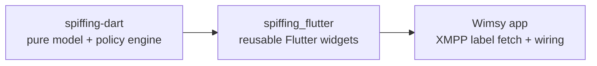

# Security labelling: can `spiffing-dart` drive a generalised label editor/picker UI?

This note reviews the vendored-adjacent `spiffing-dart` library (found at
`../spiffing-dart` relative to this repo, i.e. a sibling checkout, not
currently a dependency of Wimsy) to answer three questions:

1. Assuming we can obtain a SPIF from the server, does the library already
   provide enough to build a generalised security-label editor/picker UI?
2. Should that UI live in a package of its own?
3. If accessors/objects are missing from the library, what should be added?

## What `spiffing-dart` is

`spiffing-dart` (`pubspec.yaml` name: `spiffing`) is a pure-Dart, Flutter-free
port of the C++ `spiffing` library. Given a parsed **SPIF** (Security Policy
Information File — `Spif.fromXml`), it models:

- `Classification` — a single hierarchical level (e.g. `SECRET`), with
  `lacv`, `name`, `hierarchy`, `fgcolour`, and (optionally) `markings`.
- `TagSet` → `Tag` → `Category` — the "category" side of a label (e.g. a
  `Releasable To` tag set containing `permissive` categories like `FRA`,
  `GBR`, ...). Each level carries a `name`, ordering/type info, and optional
  `markings`.
- `Label` — a policy id + one `Classification` + a set of `Category`
  values. Supports `Label.forClassification(spif, lacv)`, `addCategory`,
  `hasCategory`, and a mutable `categories` set.
- `Clearance` — a policy id + a set of allowed classification `lacv`s + a
  set of categories, with a similarly mutable `classifications` /
  `categories` API.
- `Spif` — ties it all together: lookups (`classificationLookup(By Name)`,
  `tagSetLookup(By Name)`), validation (`valid(label)` / `assertValid`),
  access-control decisions (`acdf(label, clearance)`), human-readable
  marking rendering (`displayMarking`, `displayMarkingForClearance`), and
  cross-policy label translation (`encrypt`).
- Parsing/serialisation for BER/DER, a debug XML format, and the NATO
  ADatP-4774/4778 XML formats (`Label.parse`/`.write`, `Clearance.parse`/
  `.write`).

## Question 1: Is this enough to build a generalised label editor/picker?

**Mostly yes, with a few gaps.** The library gives a UI everything needed to:

- Render a picker for classification (`Classification.name`, `.hierarchy`,
  `.fgcolour` for colour-coding) and for categories within a tag set
  (`TagSet.categories(TagType)` returns the category set for a given tag
  type, ordered by ordinal).
- Build/mutate a `Label` (`Label.forClassification` + `addCategory`, and —
  because the `categories`/`classifications` getters return the live
  mutable `Set`, not a copy — `label.categories.remove(cat)` also works,
  see caveat below).
- Validate a candidate label against the policy (`spif.valid(label)`) after
  each edit, so the UI can reactively reject/undo an invalid combination.
- Show a live, localisable preview of the resulting marking
  (`spif.displayMarking(label, langTag: ...)`), which a picker UI would
  typically want to show alongside the editable fields.
- Perform an ACDF check against a user's `Clearance` before allowing a
  label to be saved/sent (`spif.acdf(label, clearance)`).
- Round-trip the edited label to/from the wire formats the server actually
  understands (`Label.write(Format.nato)` etc.), which is what "obtain the
  SPIF from the server somehow" implies is also needed on the label side.

So: a *reactive* picker (add a category, call `valid()`, revert if it
fails) is buildable today, entirely against the public API described in
`spiffing.dart`'s `library` export list. What's missing is the *proactive*
half — enumerating what a UI should show at all, and which of those
options are currently selectable — which is covered in Question 3.

## Question 2: Should the picker be its own package?

**Yes.** Recommended split:

Reasons:

- `spiffing-dart` deliberately has no Flutter dependency (`pubspec.yaml`
  only depends on `asn1lib`/`xml`); a widget package should stay a
  separate leaf so non-Flutter consumers (CLI tools, servers) aren't forced
  to pull in Flutter.
- The picker/editor is policy-shaped, not Wimsy-shaped: any SPIF-driven
  app (chat, document management, mail) needs essentially the same
  widgets (classification selector, per-tag-set category chips/checkboxes,
  marking preview banner, clearance-vs-label ACDF indicator). Publishing it
  separately (even if privately, e.g. a path/git dependency initially)
  avoids duplicating this UI the next time a SPIF-aware feature is added.
- It keeps Wimsy's own code limited to the XMPP-specific bits: fetching
  the SPIF/clearance from the server, deciding where in the chat UI the
  picker is shown, and wiring the resulting `Label` into whatever stanza
  extension carries it.
- Versioning independently lets `spiffing_flutter` track `spiffing-dart`
  as a normal semver dependency, and be tested/analyzed on its own
  (matching this repo's own "always run `flutter analyze`/`flutter test`"
  convention, applied to a widget package that isn't otherwise part of
  Wimsy's app target).

A pragmatic first step, if a full separate published package is premature,
is a self-contained directory (e.g. `packages/spiffing_flutter/`) inside
this monorepo with its own `pubspec.yaml`, so the boundary already exists
and extraction later is just moving a directory.

## Question 3: Missing accessors/objects — suggestions for `spiffing-dart`

These are additive, backwards-compatible suggestions (no existing public
API needs to change) that would make a *generalised* editor significantly
simpler and safer to write:

1. **Enumerate the policy itself.** `Spif` only exposes lookup-by-id/name
   (`classificationLookup`, `tagSetLookup`); there's no way to ask "what
   are *all* the classifications/tag sets in this policy?" without reaching
   into private fields. A picker needs this to populate its UI at all.
   - Add `List<Classification> get classifications` (sorted by
     `hierarchy`) and `List<TagSet> get tagSets` on `Spif`.

2. **Enumerate a tag set's tags, and a tag's categories.**
   `TagSet.categories(TagType)` aggregates categories by *type* across the
   whole tag set, but there's no public way to list the `Tag`s themselves
   (e.g. "Releasable To" vs "Eyes Only" within one tag set), nor a given
   `Tag`'s own categories (`Tag._categories` is private).
   - Add `List<Tag> get tags` on `TagSet` and `Iterable<Category> get
     categories` on `Tag`.

3. **Proactive "what's currently selectable" queries.** Today, finding out
   whether adding a given category (or classification) would make the
   label invalid requires a full add-then-`valid()`-then-maybe-revert
   round trip, and the exclusion/requirement rules
   (`Category._excludedClasses`, `_excluded`, `_required`,
   `Classification._reqCats`) are all private — a UI can't grey out
   incompatible options ahead of time, only reject them after the fact.
   - Add something like `bool Spif.wouldBeValid(Label label, {Category?
     adding, Category? removing, Classification? classification})` or,
     more UI-friendly, `Set<Category> Spif.selectableCategories(Label
     label, TagSet tagSet, TagType type)` that pre-filters to categories
     that are not excluded by the label's current classification/other
     selections. This is the single biggest gap for a *good* (not just
     technically-possible) picker.

4. **Symmetric mutation API on `Label`/`Clearance`.** Both expose
   `addCategory` but no `removeCategory`, and no way to change a `Label`'s
   classification after construction (only via the `forClassification`
   factory). Removal is *technically* possible today only because
   `categories`/`classifications` getters happen to return the live
   mutable `Set` rather than an unmodifiable view — that's an accidental
   encapsulation leak rather than a documented API.
   - Add explicit `removeCategory(Category)` to both `Label` and
     `Clearance`, a `set classification(Classification)` (or
     `changeClassification`) to `Label`, `addClassification`/
     `removeClassification` to `Clearance`, and make the collection
     getters return unmodifiable views once the explicit methods exist.
   - Add a `Label copy()` / `Clearance copy()` to support "stage an edit,
     validate, commit-or-discard" UX without hand-rolling a clone.

5. **A documented "default classification" concept.** `Spif.displayMarkingForClearance`
   has a hard-coded fallback to `_classifications[0]` for "no classification
   selected", but there's no public `Spif.defaultClassification` (or similar)
   a picker could use to pre-select something sensible/least-restrictive.

6. **Locale enumeration for `Markings`.** `Markings` can look up a marking
   by `langTag`, but can't report which language tags it actually has data
   for (`_byLangTag` is private) — useful if a picker wants to offer a
   language switcher only for languages the SPIF actually localises.
   - Add `Iterable<String> get languageTags` (or similar) to `Markings`.

7. **Per-item localized label text, not just whole-label markings.**
   `Spif.displayMarking` assembles a *whole label's* marking string, but a
   picker rendering a single checkbox/chip for one `Category` wants just
   that category's own localized phrase without re-deriving the
   prefix/suffix/separator logic itself. `Category.markings`/`Tag.markings`
   are public fields, so this is *possible* today, but a small helper
   (e.g. `Category.displayName(String langTag)` falling back to `name`)
   would remove boilerplate every consumer would otherwise duplicate.

None of the above require touching the BER/XML parsing or ACDF/encrypt
logic — they're purely additive read accessors and a couple of documented
mutation methods, so they're low-risk to add without affecting the
existing test suite in `spiffing-dart/test`.

## Summary

- `spiffing-dart` already has the core domain model and policy engine
  (parsing, validation, ACDF, marking rendering, format round-tripping)
  needed to *drive* a label editor/picker.
- It is missing a handful of "enumerate everything" and "what's compatible
  right now" accessors that a *good*, generalised UI needs; these are
  additive and should be contributed back to `spiffing-dart` rather than
  worked around in application code.
- The picker/editor itself should be a separate, Flutter-only package
  layered on top of `spiffing-dart`, kept independent of both the model
  library (which must stay Flutter-free) and of Wimsy's XMPP-specific
  glue code.
