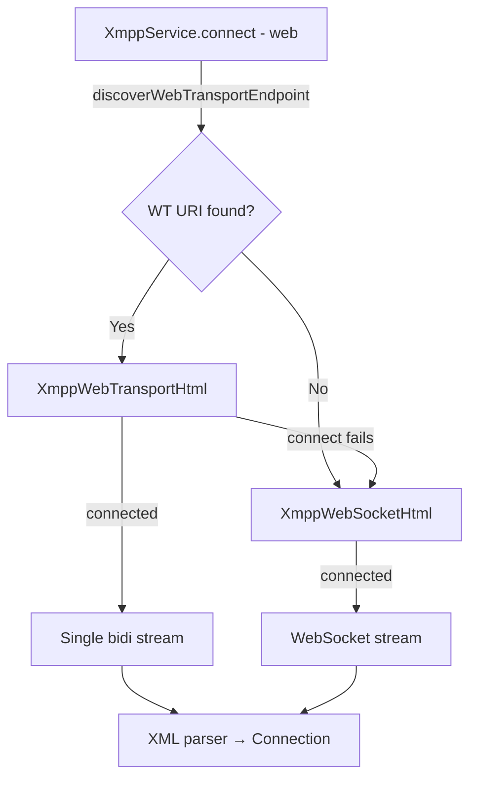

# WebTransport Plan

# doc/plan-webtransport.md

## Objective
Add WebTransport as an alternative XMPP transport on the web platform, giving the browser client a lower-latency, multiplexed option alongside the existing WebSocket fallback.

## Background
WebTransport (W3C + IETF) runs over HTTP/3 / QUIC in the browser, exposing `WebTransportBidirectionalStream` objects. The XMPP working group is developing XEP-XXXX (XMPP over WebTransport) which mirrors the multi-stream approach already used in Wimsy's QUIC implementation for native platforms. The server side already supports WebTransport; the flutter_quic plugin is native-only, so the web platform needs a separate, browser-native implementation using the `dart:js_interop` / `package:web` APIs.

## Scope
**In scope:**
- WebTransport connection establishment (`wss://` → `https://` scheme rewrite, ALPN `xmpp-webtransport`).
- Single reliable bidirectional stream carrying the full XMPP XML stream (matching Phase 1 of plan-quic.md: one channel first).
- Discovery via host-meta / host-meta.json, reusing existing `alt_connection_web.dart` logic.
- Fallback to WebSocket when WebTransport is not available or fails.
- Tests for endpoint parsing, discovery, and fallback logic.

**Out of scope (future phases):**
- Multi-stream WebTransport (aux streams per bare JID), analogous to `QuicCapableXmppSocket` on native.
- WebTransport datagrams.
- Multi-stream aware XMPP routing on the web.

## Current Baseline
- Web platform uses `XmppWebSocketHtml` (`vendor/xmpp_stone/lib/src/connection/XmppWebsocketHtml.dart`) backed by `web_socket_channel`.
- `alt_connection_web.dart` discovers a WebSocket URI via `host-meta.json` / `host-meta`.
- `XmppWebSocket` abstract class (`XmppWebsocketApi.dart`) is the extension point; adding a new implementation requires no changes to Connection.dart's upper layers.
- The browser `WebTransport` API is available in Chrome 97+, Edge 97+, Firefox 114+ (nightly/flag), Safari not yet. The `package:web` Dart package exposes it as `dart:js_interop` bindings.

## Key Decisions
 Decision | Choice | Rationale |
---|---|---|
 Discovery | Add `discoverWebTransportEndpoint` to check for `<Link rel="urn:xmpp:webtransport:0">` in host-meta | Consistent with existing host-meta discovery pattern |
 Endpoint selection | Try WebTransport first (if discovered); fall back to WebSocket | Server-side is ready; WebTransport is preferred for lower RTT |
 Stream type | Single bidirectional stream (Phase 1) | Consistent with plan-quic.md Phase 1; simpler to validate |
 Implementation | New `XmppWebTransportHtml` class implementing `XmppWebSocket` | Same extension point as `XmppWebSocketHtml`; zero change to upper layers |
 Platform guard | Compile-time `dart.library.html` conditional export (same pattern as `alt_connection_web.dart`) | No runtime platform checks needed |
 Feature detection | Check `window.hasProperty('WebTransport')` at runtime before attempting | Graceful fallback for unsupported browsers |

## Proposed Changes

### 1. `lib/xmpp/alt_connection_web.dart`
- Add `discoverWebTransportEndpoint(String domain)` function.
    - Looks for `<Link rel="urn:xmpp:webtransport:0" href="…">` in host-meta JSON / XML.
    - Returns `Uri?` (e.g. `https://xmpp.example.com/webtransport`).

### 2. New file: `vendor/xmpp_stone/lib/src/connection/XmppWebTransportHtml.dart`
- `XmppWebTransportHtml extends XmppWebSocket`:
    - `connect(...)` opens a `WebTransport(url)` connection, opens one bidi stream.
    - `write(message)` encodes to UTF-8 and writes to the send stream.
    - `listen(...)` reads chunks from the recv stream, reassembles lines, emits to subscriber.
    - `close()` calls `transport.close()`.
    - `getStreamOpeningElement(domain)` returns the XMPP framing open tag (same as WS).
    - `isWebTransport` getter → `true`.
- Fallback: if `WebTransport` constructor throws or `window` lacks `WebTransport`, throw to let caller try WebSocket.

### 3. `vendor/xmpp_stone/lib/src/connection/XmppWebsocketHtml.dart`
- Factory `createSocket()` tries `XmppWebTransportHtml` when `useWebTransport == true` and browser supports it; falls back to `XmppWebSocketHtml`.

### 4. `lib/xmpp/xmpp_service.dart` (web path)
- In `connect(...)`, after `discoverWebSocketEndpoint`, also call `discoverWebTransportEndpoint`.
- If a WebTransport URI is found, set `useWebTransport = true` and pass the URI; fall back to WebSocket on failure.

### 5. `lib/xmpp/alt_connection_parser.dart`
- Add `parseHostMetaWebTransport(String json|xml)` helpers to extract the WebTransport link relation.

### 6. Tests
- `test/alt_connection_webtransport_test.dart`:
    - `parseHostMetaWebTransport` extracts correct URI from JSON and XML fixtures.
    - `discoverWebTransportEndpoint` returns `null` when link not present.
- `test/webtransport_endpoint_test.dart`:
    - `XmppWebTransportHtml` streams parsed XML events from injected byte chunks.
    - Fallback to `XmppWebSocketHtml` when `WebTransport` not available.

## File Summary
 File | Change |
---|---|
 `lib/xmpp/alt_connection_web.dart` | Add `discoverWebTransportEndpoint` |
 `lib/xmpp/alt_connection_parser.dart` | Add WebTransport link-relation parser helpers |
 `lib/xmpp/xmpp_service.dart` | Prefer WebTransport URI when available on web |
 `vendor/xmpp_stone/lib/src/connection/XmppWebTransportHtml.dart` | New WebTransport socket implementation |
 `vendor/xmpp_stone/lib/src/connection/XmppWebsocketHtml.dart` | Try WebTransport via factory; fall back to WS |
 `test/alt_connection_webtransport_test.dart` | New parser/discovery tests |
 `test/webtransport_endpoint_test.dart` | New socket-level tests |

## Architecture Diagram

## Definition of Done
- On a browser that supports WebTransport, the web client connects via WebTransport when the server advertises it in host-meta.
- On a browser without WebTransport, the client falls back to WebSocket transparently.
- If the WebTransport connection attempt fails, WebSocket is used.
- `flutter analyze`, `flutter test` (web and general) all pass.
- `doap.xml` updated to include `xmpp:webtransport:0` with `partial` status once the XEP number is confirmed.
